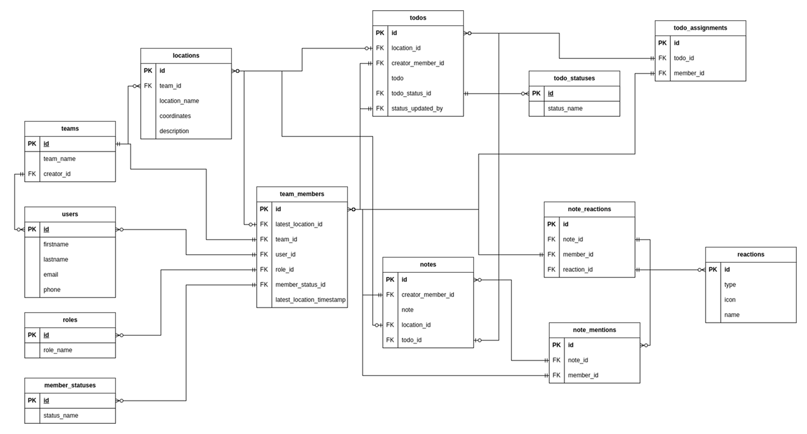

<br />
<p align="center">

  <h3 align="center">Slushy</h3>

  <p align="center">
    An app for event organizers who HATE using jira to manage their teams during an event
    <br />
    <a href="https://www.figma.com/proto/zdClLWsWxm9L3KLzr2RWSZ/Slushy?node-id=166-2027&t=IY5OepGrJJfvrCRC-1">View walkthroug</a>
    ·
    <a href="https://www.figma.com/proto/zdClLWsWxm9L3KLzr2RWSZ/Slushy?node-id=166-2027&t=IY5OepGrJJfvrCRC-1">View demo</a>
    ·
    <a href="https://www.figma.com/proto/zdClLWsWxm9L3KLzr2RWSZ/Slushy?node-id=166-2027&t=IY5OepGrJJfvrCRC-1">View prototype</a>
    ·
    <a href="https://slushybe.enddesign.co/db">Check backend</a>
    ·
    <a href="https://github.com/wickathou/slushyfe">Frontend</a>
  </p>

  <p>
  Route list for backend

Base URL
https://slushybe.enddesign.co/

### To check the DB schemas and verify if entries work

**/db**

### For auth, creating an account, login and checking your profile

**/auth**

1. **GET `/test`**

    - Handler: `(req, res) => { res.json({ title: "What you want??" }); }`
    - Description: A test route that returns a JSON response.

2. **POST `/register`**

    - Handler: `async (req: Request, res: Response) => { ... }`
    - Description: Registers a new user by inserting their details into the database and returns a JWT token.

3. **POST `/login`**

    - Handler: `async (req: Request, res: Response) => { ... }`
    - Description: Authenticates a user by checking their credentials and returns a JWT token if successful.

4. **GET `/me`**
    - Middleware: `authenticate`
    - Handler: `async (req: AuthRequest, res: Response) => { ... }`
    - Description: A protected route that returns the authenticated user's details (for development/testing purposes).

### For team, notes and todos creation

**/api**

1. **GET `/`**

    - Middleware: `authenticate`
    - Handler: `controller.index`
    - Description: Fetches the index or home page.

2. **POST `/teams`**

    - Middleware: `authenticate`
    - Handler: `controller.createTeam`
    - Description: Creates a new team.

3. **POST `/teams/:teamId/members`**

    - Middleware: `authenticate`
    - Handler: `controller.addMemberToTeam`
    - Description: Adds a member to a specific team.

4. **POST `/teams/:teamId/todos`**

    - Middleware: `authenticate`
    - Handler: `controller.createTodo`
    - Description: Creates a new to-do item for a specific team.

5. **PATCH `/teams/:teamId/todos/:todoId/status`**

    - Middleware: `authenticate`
    - Handler: `controller.updateTodoStatus`
    - Description: Updates the status of a specific to-do item in a team.

6. **POST `/teams/:teamId/notes`**
    - Middleware: `authenticate`
    - Handler: `controller.createNote`
    - Description: Creates a new note for a specific team.

Let me know if you need further clarification or modifications!

</p>

<p>

## Database schema



To create the database, these is the recipe I created

```
-- 1) Base/Lookup Tables
CREATE TABLE roles (
    id SERIAL PRIMARY KEY,
    name VARCHAR(100) NOT NULL
);

INSERT INTO roles (name) VALUES ('owner');
INSERT INTO roles (name) VALUES ('member');

CREATE TABLE member_statuses (
    id SERIAL PRIMARY KEY,
    name VARCHAR(100) NOT NULL
);

INSERT INTO member_statuses (name) VALUES ('offline');
INSERT INTO member_statuses (name) VALUES ('available');

CREATE TABLE todo_statuses (
    id SERIAL PRIMARY KEY,
    name VARCHAR(100) NOT NULL
);

INSERT INTO todo_statuses (name) VALUES ('pending');
INSERT INTO todo_statuses (name) VALUES ('done');

CREATE TABLE reactions (
    id SERIAL PRIMARY KEY,
    name VARCHAR(100) NOT NULL
);

-- 2) Main Entity Tables

CREATE TABLE users (
    id SERIAL PRIMARY KEY,
    firstname VARCHAR(255) NOT NULL,
    lastname VARCHAR(255) NOT NULL,
    email VARCHAR(255) UNIQUE NOT NULL,
    password_hash VARCHAR(255) NOT NULL
);


-- 3) Association Tables
CREATE TABLE teams (
    id SERIAL PRIMARY KEY,
    name VARCHAR(255) NOT NULL,
    creator_id INT NOT NULL,
    FOREIGN KEY (creator_id) REFERENCES users (id) ON DELETE CASCADE
);

CREATE TABLE locations (
    id SERIAL PRIMARY KEY,
    name VARCHAR(255) NOT NULL,
    team_id INT NOT NULL,
    FOREIGN KEY (team_id) REFERENCES teams (id) ON DELETE CASCADE
);

-- team_members references teams, users, roles, member_statuses
CREATE TABLE team_members (
    id SERIAL PRIMARY KEY,
    team_id INT NOT NULL,
    user_id INT NOT NULL,
    role_id INT NOT NULL,
    member_status_id INT NOT NULL,
    latest_location_id INT,
    location_updated_on TIMESTAMP DEFAULT NOW(),
    FOREIGN KEY (team_id) REFERENCES teams (id) ON DELETE CASCADE,
    FOREIGN KEY (user_id) REFERENCES users (id) ON DELETE CASCADE,
    FOREIGN KEY (role_id) REFERENCES roles (id) ON DELETE SET NULL,
    FOREIGN KEY (member_status_id) REFERENCES member_statuses (id) ON DELETE SET NULL,
    FOREIGN KEY (latest_location_id) REFERENCES locations (id) ON DELETE SET NULL
);


-- If latest_location_id is changed, update the timestamp
CREATE FUNCTION update_location_updated_on()
RETURNS TRIGGER AS $$
BEGIN
    IF NEW.latest_location_id IS DISTINCT FROM OLD.latest_location_id THEN
        NEW.location_updated_on := NOW();
    END IF;
    RETURN NEW;
END;
$$ LANGUAGE plpgsql;

-- Triggers when a team_member's location is updated
CREATE TRIGGER tr_update_location_timestamp
BEFORE UPDATE ON team_members
FOR EACH ROW
EXECUTE PROCEDURE update_location_updated_on();


-- todos references members (author), locations, todo_statuses
CREATE TABLE todos (
    id SERIAL PRIMARY KEY,
    team_id INT NOT NULL,
    author_member_id INT NOT NULL,
    location_id INT,
    status_id INT NOT NULL,
    title VARCHAR(255) NOT NULL,
    description TEXT,
    status_updated_by INT,
    created_at TIMESTAMP DEFAULT NOW(),
  	due_date TIMESTAMP,
    FOREIGN KEY (team_id) REFERENCES teams (id) ON DELETE CASCADE,
    FOREIGN KEY (author_member_id) REFERENCES team_members (id) ON DELETE CASCADE,
    FOREIGN KEY (status_updated_by) REFERENCES team_members (id) ON DELETE SET NULL,
    FOREIGN KEY (location_id) REFERENCES locations (id) ON DELETE SET NULL,
    FOREIGN KEY (status_id) REFERENCES todo_statuses (id) ON DELETE SET NULL
);

-- todo_assignments references todos, members
CREATE TABLE todo_assignments (
    id SERIAL PRIMARY KEY,
    todo_id INT NOT NULL,
    member_id INT NOT NULL,
    FOREIGN KEY (todo_id) REFERENCES todos (id) ON DELETE CASCADE,
    FOREIGN KEY (member_id) REFERENCES team_members (id) ON DELETE CASCADE
);

-- notes references members (author), todos, teams
CREATE TABLE notes (
    id SERIAL PRIMARY KEY,
    team_id INT NOT NULL,
    author_member_id INT NOT NULL,
    todo_id INT,
    location_id INT,
    content TEXT NOT NULL,
    created_at TIMESTAMP DEFAULT NOW(),
    FOREIGN KEY (team_id) REFERENCES teams (id) ON DELETE CASCADE,
    FOREIGN KEY (author_member_id) REFERENCES team_members (id) ON DELETE CASCADE,
    FOREIGN KEY (todo_id) REFERENCES todos (id) ON DELETE SET NULL,
    FOREIGN KEY (location_id) REFERENCES locations (id) ON DELETE SET NULL
);

-- note_reactions references notes, reactions, users
CREATE TABLE note_reactions (
    id SERIAL PRIMARY KEY,
    note_id INT NOT NULL,
    reaction_id INT NOT NULL,
    member_id INT NOT NULL,
    FOREIGN KEY (note_id) REFERENCES notes (id) ON DELETE CASCADE,
    FOREIGN KEY (reaction_id) REFERENCES reactions (id) ON DELETE CASCADE,
    FOREIGN KEY (member_id) REFERENCES team_members (id) ON DELETE CASCADE
);

-- note_mentions references notes, users
CREATE TABLE note_mentions (
    id SERIAL PRIMARY KEY,
    note_id INT NOT NULL,
    mentioned_member_id INT NOT NULL,
    FOREIGN KEY (note_id) REFERENCES notes (id) ON DELETE CASCADE,
    FOREIGN KEY (mentioned_member_id) REFERENCES team_members (id) ON DELETE CASCADE
);

```

</p>
